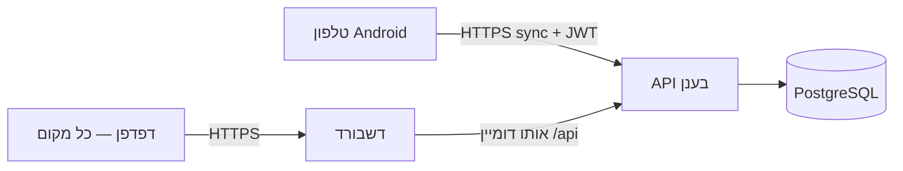

# Cloud / remote access — טלפון ודשבורד בלי אותה Wi‑Fi

כדי שהטלפון יישאר בבית (או בכל רשת) והדשבורד ייפתח מהמחשב או מהעבודה — צריך **שרת באינטרנט** עם כתובת **HTTPS** (מומלץ).

## איך זה עובד



1. **API** + **PostgreSQL** על VPS / Railway / Render / Fly.io וכו'
2. **דשבורד Web** — אותו שרת (Docker) או Vercel עם `VITE_API_URL`
3. **APK** נבנה עם `EXPO_PUBLIC_API_URL=https://api.example.com` (חובה **https**)
4. בטלפון: Cloud sync + התחברות לקוח → נתונים עולים לענן
5. בדפדפן: `https://dashboard.example.com/login` — אותו משתמש → רואים את המכשיר

---

## אפשרות א' — Docker על VPS (מומלץ להתחלה)

שרת Linux עם Docker (DigitalOcean, Hetzner, AWS EC2…).

### 1. הכן `.env` בשורש הפרויקט

```bash
cp .env.example .env
```

ערוך (דוגמה):

```env
JWT_SECRET=החלף-במחרוזת-ארוכה-אקראית
ADMIN_PASSWORD=סיסמה-חזקה-למנהל
POSTGRES_PASSWORD=סיסמה-חזקה-ל-db
WEB_PORT=8080
DEV_SIMULATOR=false
```

### 2. הרם את המערכת

```bash
docker compose -f docker-compose.cloud.yml up -d --build
```

- דשבורד + API (דרך nginx): `http://כתובת-השרת:8080`
- בדיקה: `http://כתובת-השרת:8080/health`

Seed של מנהל רץ אוטומטית (`RUN_DB_SEED=true`) — התחבר עם `ADMIN_EMAIL` / `ADMIN_PASSWORD`.

### 3. HTTPS (חובה לטלפון ברשת סלולרית)

הוסף לפני Docker אחד מאלה:

- **Caddy** / **Traefik** עם Let's Encrypt → `https://guardian.yourdomain.com` → proxy ל-`:8080`
- או **Cloudflare Tunnel** (בלי לפתוח פורטים)

אחרי HTTPS:

- דשבורד: `https://guardian.yourdomain.com`
- API לטלפון: **אותו דומיין** — `https://guardian.yourdomain.com` (האפליקציה קוראת ל-`/api/v1/...`)

אם ה-API ב-subdomain נפרד:

- `https://api.yourdomain.com` — רק ל-APK (`EXPO_PUBLIC_API_URL`)
- דשבורד עם build: `VITE_API_URL=https://api.yourdomain.com`

### 4. בנה APK ללקוחות

```bash
EXPO_PUBLIC_DEV_SIMULATOR=false \
EXPO_PUBLIC_API_URL=https://guardian.yourdomain.com \
./scripts/build-release-apk.sh
```

(או EAS עם אותם env — ראה `apps/mobile/eas.json`.)

### 5. בטלפון

1. התקן APK
2. VPN / ניטור — onboarding
3. **Settings → Cloud sync** ON
4. התחבר עם **חשבון לקוח** (מנהל יוצר ב-`/admin/users`)
5. המכשיר מסתנכרן — רואים בדשבורד מכל מקום

---

## אפשרות ב' — Render (Blueprint)

מדריך מלא: **[RENDER.md](./RENDER.md)** — `render.yaml` ב-repo, PostgreSQL + API (Docker) + דשבורד Static, HTTPS מובנה.

```text
Render Dashboard → New → Blueprint → repo → הגדר ADMIN_PASSWORD → Apply
```

---

## אפשרות ג' — שירותים מנוהלים אחרים (בלי VPS)

| רכיב       | שירות לדוגמה                                                        |
| ---------- | ------------------------------------------------------------------- |
| PostgreSQL | Neon, Supabase, Railway Postgres                                    |
| API        | Railway, Render, Fly.io (Dockerfile `apps/api/Dockerfile`)          |
| Web        | Vercel / Netlify — build `apps/web`, env `VITE_API_URL=https://...` |

חשוב:

- `DEV_SIMULATOR=false` ב-production
- `pnpm db:migrate` + `pnpm db:seed` על ה-API
- `CORS_ORIGIN=https://your-dashboard-url` (או `*` לבדיקה)

---

## מה **לא** עובד מרחוק

| לא                         | למה                                    |
| -------------------------- | -------------------------------------- |
| `localhost:3000` בטלפון    | localhost על הטלפון = הטלפון, לא המחשב |
| `http://192.168.x.x` מרחוק | IP ביתי לא נגיש מחוץ ל-Wi‑Fi           |
| Expo Go + VPN אמיתי        | צריך APK / dev build                   |

---

## צ'ק-ליסט

- [ ] API + DB בענן, `DEV_SIMULATOR=false`
- [ ] HTTPS על כתובת ציבורית
- [ ] seed / מנהל — שינוי סיסמה
- [ ] APK עם `EXPO_PUBLIC_API_URL` נכון
- [ ] לקוח: Cloud sync + login
- [ ] דשבורד: login → מכשיר + התראות אחרי sync

פרטי תפקידים והתחברות: [CUSTOMERS-AUTH.md](./CUSTOMERS-AUTH.md).
